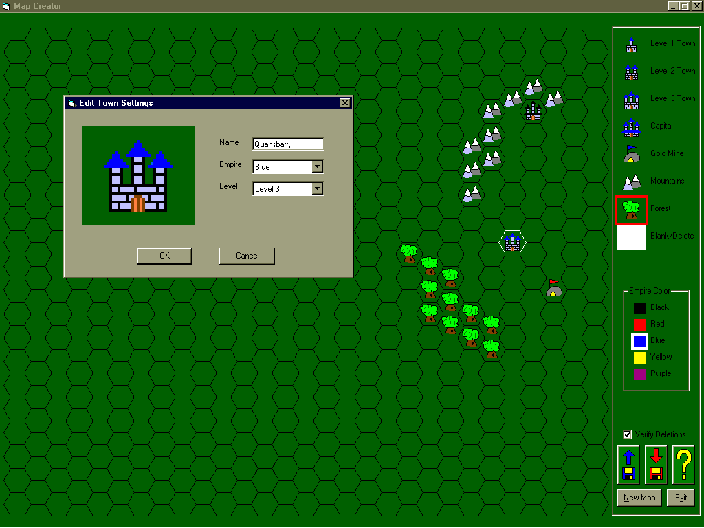



## Game/Map Creator \(previously Hex Grid Generator\)

### Description

MUST see screenshot. This is further work on the previous Hex Grid Generator entry a few days ago, but now with primitive homemade graphics (don't laugh) and functionality to create maps. Since it's going to be a fantasy strategy play by email (PBEM) game, it also includes an address book where you set up people's names and their emails for use when setting up a game once I've finished coding it, which will include fighting units that level up with experience, auto-combat rules, movement, building structures, spells, etc. Also note this program only works effectively with screen resolutions of 1024 x 768 or higher.

Bonuses: This code makes extensive use of classes, including my own BitBlt Engine which I use all the time to load graphics into memory directly from files, and then with some very easy commands I can paint without the hassle of all the BitBlt or StretchBlt parameters unless I need to use them, so check it out as it's well commented. This project also includes a nice ini file class which I've used for years. And you may find the handy little Help Form included to be useful in your own apps.

The response to this entry will determine if I post the entire completed project to PSC as it develops or not since I'm starting to feel protective of the complex growing code. But if it's something enough people are interested in, I'll keep posting. In such an event, my tentative title for this game is Battle Squads so keep a lookout for it. Plus, are there any game tester guinea pigs I could use in trying to help find game balance when version 1.0 is complete? (You'll end up in the credits). Opinions are also wanted to some questions I'll post in the response area, and as always, a vote would be appreciated.
 
### More Info
 

             |
---                |---
**Submitted On**   |2001-06-10 17:36:52
**By**             |[JYoder](https://github.com/Planet-Source-Code/PSCIndex/blob/master/ByAuthor/jyoder.md)
**Level**          |Advanced
**User Rating**    |4.9 (49 globes from 10 users)
**Compatibility**  |VB 6\.0
**Category**       |[Games](https://github.com/Planet-Source-Code/PSCIndex/blob/master/ByCategory/games__1-38.md)
**World**          |[Visual Basic](https://github.com/Planet-Source-Code/PSCIndex/blob/master/ByWorld/visual-basic.md)
**Archive File**   |[Game\_Map C210236112001\.zip](https://github.com/Planet-Source-Code/jyoder-game-map-creator-previously-hex-grid-generator__1-24000/archive/master.zip)

